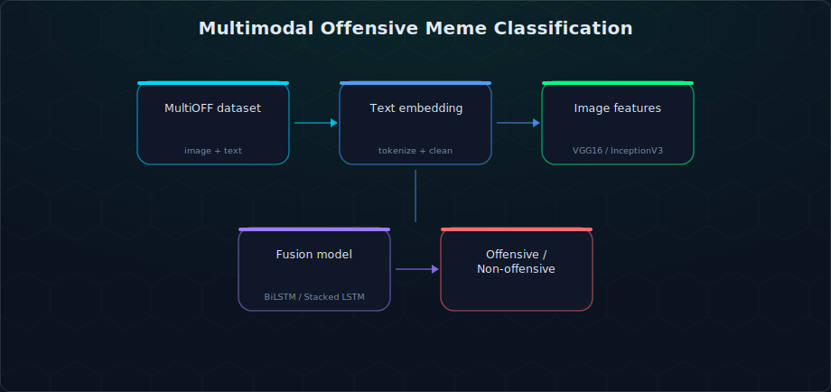

# Multimodal Offensive Meme Detection

A multimodal classifier that decides whether a meme is offensive by reading **both** its image and its text — built on the published **MultiOFF** dataset, comparing four model architectures end to end.

## What it does

Memes are a hard classification target because the offense often lives in the *combination* of image and caption, not either alone. This project extracts image features with pretrained CNNs (**VGG16** / **InceptionV3**) and text features through cleaned, tokenized embeddings, then fuses both modalities through several architectures — a stacked LSTM, a BiLSTM, a CNN-text + VGG16 hybrid, and classical baselines (Logistic Regression / Naive Bayes / a small DNN) — to compare how much multimodal fusion actually helps over text-only or image-only baselines.



## Key features

- **Dataset**: [MultiOFF](https://aclanthology.org/2020.trac-1.6/) — labelled offensive/non-offensive memes with paired image + text
- **Four model families** evaluated side by side: Stacked LSTM+VGG16, BiLSTM+VGG16, CNN-text+VGG16, and classical ML baselines (LR / NB / DNN)
- **Text preprocessing**: stopword removal, symbol/email stripping, GloVe (50d) word embeddings
- **Image features**: transfer learning from VGG16 / InceptionV3 (ImageNet-pretrained)
- **Late fusion** of modality embeddings before the final classification layer

## Tech stack

`Python` · `Keras / TensorFlow (VGG16, InceptionV3)` · `NLTK` · `GloVe embeddings` · `scikit-learn` · `pandas`

## Repository structure

```
offensive_meme_classification/
├── Multimodal_baseline_Functions.py    # Shared preprocessing + feature extraction
├── Stacked_LSTM_VGG16.ipynb
├── BiLSTM_VGG16.ipynb
├── CNN_text_VGG16.ipynb
├── LR_NB_DNN.ipynb                     # Classical baselines
├── WebScrapping.py
└── requirements.txt
```

## Setup

```bash
git clone https://github.com/ananthakrishna4747/offensive_meme_detection.git
cd offensive_meme_detection/offensive_meme_classification
pip install -r requirements.txt
```

1. Download [GloVe 50d embeddings](http://nlp.stanford.edu/data/glove.6B.zip)
2. Download the [MultiOFF dataset](https://drive.google.com/drive/folders/1hKLOtpVmF45IoBmJPwojgq6XraLtHmV6?usp=sharing) (train/val/test splits + labelled images) and update the paths in the notebooks
3. Run the notebooks in order: `Stacked_LSTM_VGG16.ipynb` → `BiLSTM_VGG16.ipynb` → `CNN_text_VGG16.ipynb` → `LR_NB_DNN.ipynb`

## Citation

If you use the dataset this project is built on, please cite the original paper:

```bibtex
@inproceedings{suryawanshi-etal-2020-multioff,
  title     = "Multimodal Meme Dataset (MultiOFF) for Identifying Offensive Content in Image and Text",
  author    = "Suryawanshi, Shardul and Chakravarthi, Bharathi Raja and Arcan, Mihael and Buitelaar, Paul",
  booktitle = "Proceedings of the Second Workshop on Trolling, Aggression and Cyberbullying (TRAC-2020)",
  year      = "2020",
  publisher = "Association for Computational Linguistics"
}
```

## License

No license file is currently included in this repository — treat as personal/educational project code.
